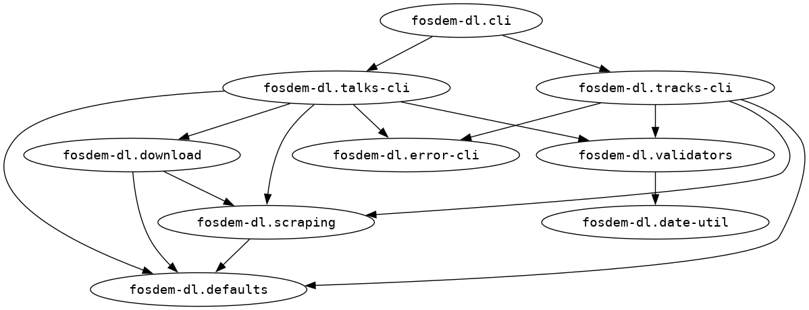

# fosdem-dl (FOSDEM talks downloder)


Download all talks from a [FOSDEM](https://fosdem.org/) conference track in a specific year.

## Installation

>[!IMPORTANT]
> At the moment this project is only available on [GitHub Releases](https://github.com/jackdbd/fosdem-dl/releases) as [Babashka uberjar](https://book.babashka.org/#_uberjar).

To use the CLI you will need to have:

1. [Babashka](https://babashka.org/) installed on your machine.
1. A [pod-jackdbd-jsoup](https://github.com/jackdbd/pod-jackdbd-jsoup) binary for your combination of OS/architecture.
1. Execution permissions on the pod binary (e.g. `chmod +x pod-jackdbd-jsoup`).
1. A file structure like the one below.

```sh
.
├── fosdem-dl-0.1.0-RC.1.jar
└── resources
   └── pod
      └── pod-jackdbd-jsoup
```

If all these requirements are met, you can use the CLI with:

```sh
bb fosdem-dl-0.1.0-RC.1.jar
```

>[!NOTE]
> I'm trying to understand how to bundle a Babashka pod in a binary compiled with GraalVM native-image.

## Usage

This project strives to follow the [Command Line Interface Guidelines](https://clig.dev/).

The CLI has two commands: `talks` and `tracks`.

```sh
FOSDEM Downloader

Usage: fosdem-dl <command> [options]
Available commands: tracks, talks
```

This is the help for the `talks` command.

```sh
FOSDEM Downloader (talks)

Download all talks given at a conference track at FOSDEM a given year.

Options:
  -a, --attachments       Whether to download each talk's attachments (PDFs, slides, etc)
  -f, --format      :webm Video format #{:webm :mp4}
  -h, --help              Help
      --timeout     10000 HTTP connection timout in milliseconds
  -t, --track             Conference track (e.g. databases)
  -y, --year              Year of FOSDEM

Examples:
fosdem-dl talks -y 2020 --track databases [options]
```

This is the help for the `tracks` command.

```sh
FOSDEM Downloader (tracks)

List the tracks at FOSDEM a given year.

Options:
  -h, --help Help
  -y, --year Year of FOSDEM

Examples:
fosdem-dl tracks -y 2020
```

>[!TIP]
> You can invoke the help of each command with `-h`, `--help`, `:h`, or `:help`.

### Examples

List all [FOSDEM 2020 conference tracks](https://archive.fosdem.org/2020/schedule/tracks/).

```sh
fosdem-dl tracks -y 2020
```

Download all videos of the [FOSDEM 2018 python track](https://archive.fosdem.org/2018/schedule/track/python/), in WebM format.

```sh
fosdem-dl talks -y 2018 -t python
```

Download all videos and attachments of the [FOSDEM 2020 web performance track](https://archive.fosdem.org/2020/schedule/track/web_performance/), in MP4 format.

```sh
fosdem-dl talks -y 2020 -t web_performance -f mp4 -a
```

## Development

The file [`devenv.nix`](./devenv.nix) declares a developer environment for this project. This file is used by [devenv](https://github.com/cachix/devenv) to create such environment. If you don't use devenv you can ignore this file, or use it to understand which dependencies are required by this project.

This project uses a [`bb.edn`](./bb.edn) file to define a few [Babashka tasks](https://book.babashka.org/#tasks). You can type `bb tasks` to view them.

### Download an unregistered version of `pod-jackdbd-jsoup`

A specific version of `pod-jackdbd-jsoup` might not be *registered* on the [Babashka pod registry](https://github.com/babashka/pod-registry), but you can always download that pod from [GitHub Releases](https://github.com/jackdbd/pod-jackdbd-jsoup/releases).

Make sure to set the environment variable `POD_JACKDBD_JSOUP_VERSION` to the desired version, then run this script.

```sh
./download_pod_jackdbd_jsoup.sh
```

### Namespace dependency graph



### Tests

Run all tests with either one of the following commands:

```sh
./test_runner.clj
bb test
```

## TODO

1. Bundle [pod-jackdbd-jsoup](https://github.com/jackdbd/pod-jackdbd-jsoup) in the binary compiled with GraamVM native-image.
1. Make the destination directory configurable, to let the user decide where to download the files.
1. Include the talk's links too? Maybe write them in a text/markdown file?
1. Show a progress bar. See [here](https://github.com/babashka/babashka.curl/issues/34).
1. Consider implementing a GUI with [pod-babashka-lanterna](https://github.com/babashka/pod-babashka-lanterna)?
