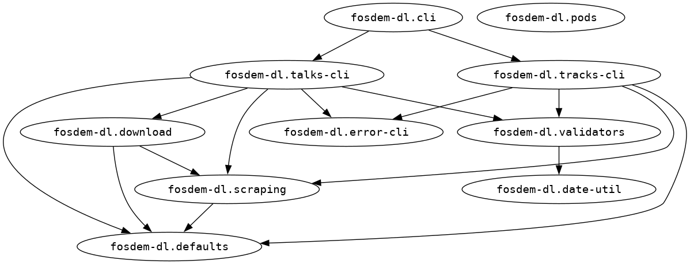

# fosdem-dl (FOSDEM talks downloder)


Download all talks from a [FOSDEM](https://fosdem.org/) conference track in a specific year.

## Installation

fosdem-dl is distributed as an uberjar, a [Babashka uberjar](https://book.babashka.org/#_uberjar) and a container image.

## Babashka uberjar (recommended)

If you have [Babashka](https://babashka.org/) installed on your machine, the recommended way to run this project is to download the Babashka uberjar from [GitHub Releases](https://github.com/jackdbd/fosdem-dl/releases) (it's the `.jar` without the `-standalone` suffix) and run it. For example, for version `0.1.0-RC.1`:

```sh
bb fosdem-dl-0.1.0-RC.1.jar
```

## Uberjar

If you prefer the "standard" uberjar, you can download it from [GitHub Releases](https://github.com/jackdbd/fosdem-dl/releases) and run it like this:

```sh
java -jar fosdem-dl-0.1.0-RC.1-standalone.jar
```

## Container image

In alternative, you can also pull the container image from [GitHub Packages](https://github.com/jackdbd/fosdem-dl/pkgs/container/fosdem-dl)...

```sh
docker pull ghcr.io/jackdbd/fosdem-dl:latest
```

...and run it like this:

```sh
docker run --rm ghcr.io/jackdbd/fosdem-dl:latest
```

> [!TIP]
> You could create a bash alias instead of having to type that `docker run` command every single time.

## Binary [TODO]

> [!WARNING]
> GraalVM native-image can generate a Linux binary from the uberjar, but it immediately crashes at runtime. I'm investigating the issue.

## Usage

This project strives to follow the [Command Line Interface Guidelines](https://clig.dev/).

The CLI has two commands: `talks` and `tracks`.

```sh
FOSDEM Downloader

Usage: fosdem-dl <command> [options]
Available commands: tracks, talks
```

This is the help for the `talks` command.

```sh
FOSDEM Downloader (talks)

Download all talks given at a conference track at FOSDEM a given year.

Options:
  -a, --attachments       Whether to download each talk's attachments (PDFs, slides, etc)
  -f, --format      :webm Video format #{:webm :mp4}
  -h, --help              Help
      --timeout     10000 HTTP connection timout in milliseconds
  -t, --track             Conference track (e.g. databases)
  -y, --year              Year of FOSDEM

Examples:
fosdem-dl talks -y 2020 --track databases [options]
```

This is the help for the `tracks` command.

```sh
FOSDEM Downloader (tracks)

List the tracks at FOSDEM a given year.

Options:
  -h, --help Help
  -y, --year Year of FOSDEM

Examples:
fosdem-dl tracks -y 2020
```

> [!TIP]
> You can invoke the help of each command with `-h`, `--help`, `:h`, or `:help`.

### Examples

List all [FOSDEM 2020 conference tracks](https://archive.fosdem.org/2020/schedule/tracks/).

```sh
fosdem-dl tracks -y 2020
```

Download all videos of the [FOSDEM 2018 python track](https://archive.fosdem.org/2018/schedule/track/python/), in WebM format.

```sh
fosdem-dl talks -y 2018 -t python
```

Download all videos and attachments of the [FOSDEM 2020 web performance track](https://archive.fosdem.org/2020/schedule/track/web_performance/), in MP4 format.

```sh
fosdem-dl talks -y 2020 -t web_performance -f mp4 -a
```

## Development

### Developer environment

The file [`devenv.nix`](./devenv.nix) declares a developer environment for this project. This file is used by [devenv](https://github.com/cachix/devenv) to create such environment. If you're cloning this repository and not using devenv, you can safely ignore this file. However, you can still use it as a reference to understand the project's required dependencies.

### Tasks to manage the project

This project uses a [`bb.edn`](./bb.edn) file to define a few [Babashka tasks](https://book.babashka.org/#tasks). You can type `bb tasks` to view them. Some tasks might work only on Linux.

### Download an unregistered version of `pod-jackdbd-jsoup`

A specific version of `pod-jackdbd-jsoup` might not be *registered* on the [Babashka pod registry](https://github.com/babashka/pod-registry), but it might be available on [GitHub Releases](https://github.com/jackdbd/pod-jackdbd-jsoup/releases), so you can download it from there.

Make sure to set the environment variable `POD_JACKDBD_JSOUP_VERSION` to the desired version, then run this script (you will need to have the [GitHub CLI](https://cli.github.com/) installed).

```sh
./download_pod_jackdbd_jsoup.sh
```

> [!NOTE]
> `pod-jackdbd-jsoup` is available both as a binary and as an uberjar. This script will download both.

### Namespace dependency graph

This graph represents the dependencies between the namespaces of this project. The graph was generated by [clj-hiera](https://github.com/greglook/clj-hiera).



### Tests

Run all tests with either one of the following commands:

```sh
./test_runner.clj
bb test
```

## TODO

1. Bundle [pod-jackdbd-jsoup](https://github.com/jackdbd/pod-jackdbd-jsoup) in the binary compiled with GraamVM native-image.
1. Make the destination directory configurable, to let the user decide where to download the files.
1. Consider scraping each talk's links. Maybe write them in a text/markdown/JSON file.
1. Show a progress bar. See [here](https://github.com/babashka/babashka.curl/issues/34).
